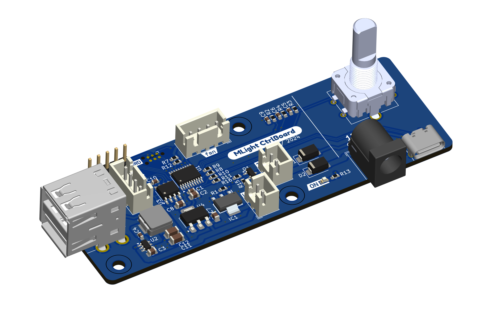
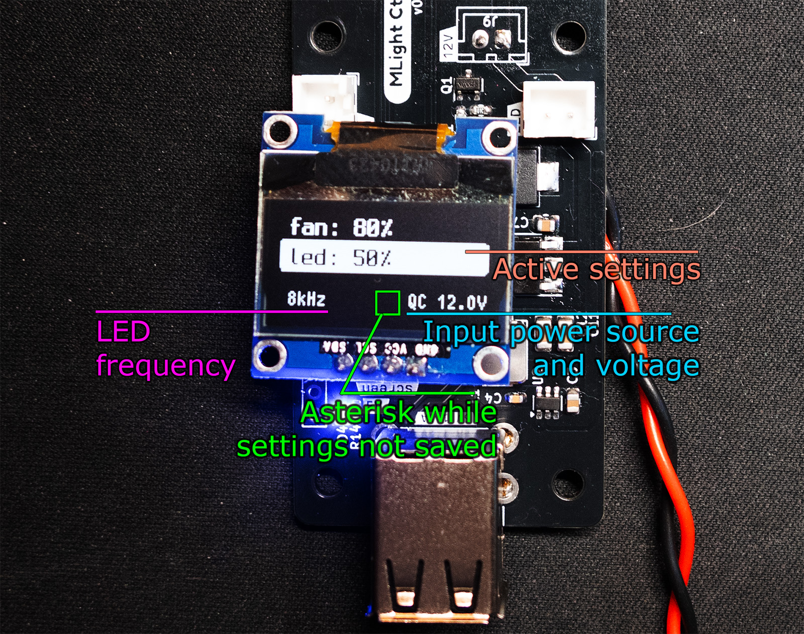
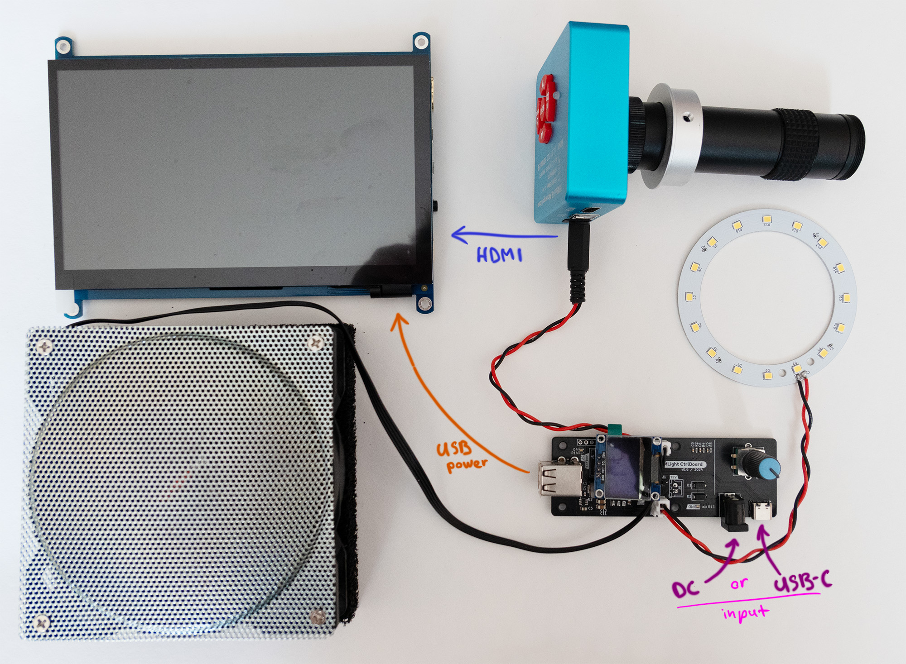

# MLight

MLight is a compact, all-in-one control board designed to manage auxiliary tools for soldering equipment. It was primarily developed for an affordable Chinese digital microscope, aiming to reduce the number of power cords and to integrate lighting for the microscope. Additionally, it can control the fan of a basic DIY fume extractor, built using a PC fan and an aquarium coal filter, and provide power to a small external HDMI display for the microscope.

Features of the Control Board:

* Capable of being powered by an external DC 12V source or a QuickChange USB source.
* Bypasses power to the microscope only when the voltage is at 12V.
* Custom ring light with PWM (Pulse Width Modulation) brightness control.
* The PWM for the light is configurable at frequencies of 1 kHz, 4 kHz, 8 kHz, or 16 kHz to prevent image distortion from the microscope.
* Provides a 12V output for PC fan with PWM speed control support for the DIY fume extractor.
* Features a USB output of 1.5A for powering an external HDMI display.
* Includes an OLED display and encoder for easy control.
* Equipped with external EEPROM memory for storing and restoring settings.

[A brief demonstration video of the system in operation.](https://youtube.com/shorts/ih5DoEOJhLI)

## Controls

| Action | Description |
|--------|-------------|
| Encoder short press | Switch between fan and light |
| Encoder rotate | Change the value of current selected element |
| Encoder long press | Disable/enable fan and light |
| Encoder rotate pressed | Change the light PWM frequency |

## Project parts

### Firmware

The `firmware` folder includes an STM32CubeIDE CMake project, with all source code developed using CMSIS.

### Control Board

The KiCad project is located in the `hardware/control_board` directory. It includes a BOM file in the project root and an interactive BOM (iBOM) in the `bom` folder to facilitate assembly.

### Ring Light

The same structure applies to the Ring Light project, with its root located in the `hardware/ring_light` directory. It also contains a BOM file in the project root and an interactive BOM (iBOM) in the `bom` folder to assist with assembly.

### 3d

The `3d` folder contains STL files and Fusion 360 source files for the brackets used to mount the control board and ring light onto a microscope stand.

## Display elements

## Components block diagram

## BOM

### Control Board

|Reference|Value|Qty|Manufacturer Part Number|LCSC|MOUSER|
|---------|-----|---|------------------------|----|------|
|C1,C4,C10|100nF|3|CL10B104KB8NNNC|C1591|187-CL10B104KB8NNNC |
|C2|4.7uF|1|CL21A475KAQNNNE|C1779|187-CL21A475KAQNNNE |
|C3,C7,C8|10uF|3|CL21A106KOQNNNE|C1713|187-CL21A106KOQNNNE |
|C5,C6,C9|10nF|3|CL10B103JB8NNNC|C7248|187-CL10B103JB8NNNC |
|C11,C12|22uF|2|CL31A226KAHNNNE|C12891|187-CL31A226KAHNNNE |
|D1,D2|B340|2|B340A-13-F|C85098|621-B340A-F|
|D3|LED|1|150060BS75000|C84266|710-150060BS75000|
|D4|LED|1|150060RS75000|C84263|710-150060RS75000|
|IC1|FZT1049ATA|1|FZT1049ATA|C73835|522-FZT1049ATA|
|J1|USB_A_Stacked|1| 67298-4090|C908455|538-67298-4090|
|J3|Light|1||C158012||
|J4|Fan|1|47053-3000|C19795120|538-47053-3000|
|J5|OLED SSD1306|1||||
|J7|USB_C_Receptacle_USB2.0|1|GSB1C211110DS1HR|C709357|523-GSB1C211110DS1HR|
|J8|Barrel_Jack|1|KLDHCX-0202-BP-LT|C720558|806-KLDHCX0202BPLT|
|J9|Conn_01x02|1||C158012||
|L1|4.7uH|1|IHLP2525CZER4R7M01|C553961|70-IHLP2525CZER4R7M1|
|Q1|AO3400A|1|AO3400A|C20917|942-IRLML6344TRPBF|
|R1,R2,R3,R4,R5,R6,R8,R10,R15|10k|9|RC0603FR-0710KL|C98220|603-RC0603FR-0710KL|
|R7|180k|1|RC0603FR-07180KL|C123419|603-RC0603FR-07180KL|
|R9,R11|2.2k|2|RC0603FR-072K2L|C114662|603-RC0603FR-072K2L|
|R12|33k|1|RC0603FR-0733KL|C126359|603-RC0603FR-0733KL|
|R13,R16|1k|2|RC0603FR-071KL|C22548|603-RC0603FR-071KL|
|R14|1.8k|1|RC0603FR-071K8L|C185354|603-RC0603FR-071K8L|
|SW4|RotaryEncoder_Switch|1|C18164805|652-PEC12R-4220F-S24|PEC12R-4220F-S0024|
|U1|STM32G030F6Px|1|STM32G030F6P6TR|C529330|511-STM32G030F6P6TR|
|U2|AP63205WU|1|AP63205WU-7|C2071056|621-AP63205WU-7|
|U3|M24C02-WMN|1|M24C02-RMN6TP|C83836|511-M24C02-RMN6TP|
|U4|NCP1117-3.3_SOT223|1|NCP1117ST33T3G|C26537|863-NCP1117ST33T3G|

### Ring Light

|Reference|Value|Qty|Manufacturer Part Number|LCSC|MOUSER|
|---------|-----|---|------------------------|----|------|
|D1,D2,D3,D4,D5,D6,D7,D8,D9,D10,D11,D12,D13,D14,D15,D16|LED|16|JE2835AWT-R-H40EA0000-N0000001|C5220767|941-JE2835AWTH40EAN|
|R1,R2,R3,R4|0|4|RC0603JR-070RL|C95177|603-RC0603JR-070RL|
